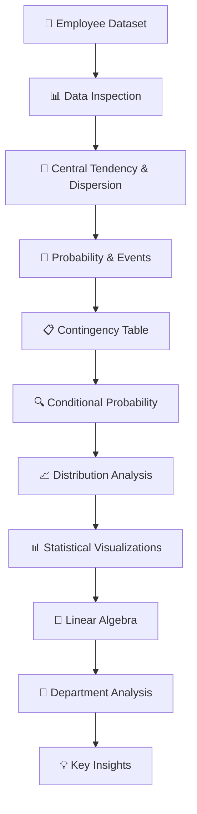

# 📊 PR-SET B | Employee Performance Analysis

<p align="center">
  <strong>Mathematics & Advanced Statistics — Employee Performance Project</strong><br>
  Using descriptive statistics, probability, distributions, visualization, linear algebra, and Python-based data analysis.
</p>

<p align="center">
  
  
  
  
  
  
</p>

---

## 🧭 Quick Navigation

<details open>
<summary><strong>Click to explore the project</strong></summary>

- [📌 Overview](#-overview)
- [📂 Project Files](#-project-files)
- [📊 Dataset](#-dataset)
- [🎯 Project Objectives](#-project-objectives)
- [📐 Statistical Analysis](#-statistical-analysis)
- [🎲 Probability Analysis](#-probability-analysis)
- [📈 Distribution & Visualization](#-distribution--visualization)
- [🔢 Linear Algebra](#-linear-algebra)
- [🏢 Department Analysis](#-department-analysis)
- [💡 Key Results](#-key-results)
- [🛠️ Technologies](#️-technologies)
- [🚀 How to Run](#-how-to-run)
- [📁 Repository Structure](#-repository-structure)
- [✅ Conclusion](#-conclusion)

</details>

---

## 📌 Overview

**Employee Performance Analysis** is a Mathematics & Advanced Statistics practical project based on a synthetic employee dataset containing **4,000 records**.

The project applies Python to study employee salary, project completion, working hours, performance score, department, and promotion status. The analysis combines mathematical concepts with practical data analysis so that the results can be reproduced directly from the CSV dataset.

The main practical work includes:

- Mean, median and mode of salary
- Range, variance and standard deviation of projects completed
- Probability of promotion
- Conditional probability of promotion for high-performing employees
- Department vs promotion contingency table
- Salary histogram with a Gaussian curve
- Skewness and excess kurtosis
- Q-Q plot of projects completed
- Work vectors, dot product, L1/L2 norms and angle between vectors
- Department-level performance and promotion analysis

---

# 📂 Project Files

| File | Purpose |
|---|---|
| `employee_performance.csv` | Main dataset containing 4,000 employee records |
| `Employee_Performance_Analysis.ipynb` | Jupyter Notebook containing the Python analysis, calculations and visualizations |
| `employee_performance_analysis.py` | Standalone Python version of the practical analysis |
| `Employee_Performance_Report.docx` | Solved project report with theory, calculations, tables and results |
| `Employee_Performance_Report.pdf` | PDF version of the project report |
| `Employee_Performance_Analysis.xlsx` | Excel workbook containing the dataset and summary analysis |
| `plots/` | Generated statistical and analytical plots |
| `requirements.txt` | Python packages used in the project |

<details>
<summary><strong>📖 What is inside the project report?</strong></summary>

The report covers the short theory questions from Part A and the practical analysis from Part B, including:

- Mean, median and mode
- Range and variance
- Normal and Poisson distributions
- Skewness
- Conditional probability
- Independent and mutually exclusive events
- Bayes theorem
- PCA in simple words
- Central tendency and dispersion
- Promotion probability
- Contingency table
- Conditional probability calculation
- Distribution analysis
- Q-Q plot
- Linear algebra calculations
- Key project insights

</details>

---

# 📊 Dataset

The dataset contains **4,000 synthetic employee records** created for this educational project.

### Dataset columns

| Column | Meaning |
|---|---|
| `Employee_ID` | Unique employee identifier |
| `Department` | Employee department |
| `Age` | Employee age |
| `Salary` | Annual salary in INR |
| `Projects_Completed` | Number of completed projects |
| `Working_Hours` | Working hours |
| `Performance_Score` | Employee performance score from 0–100 |
| `Promotion_Status` | Promotion result (`Yes` / `No`) |

<details>
<summary><strong>🔎 Dataset snapshot</strong></summary>

| Metric | Value |
|---|---:|
| Total employees | **4,000** |
| Promoted | **1,562** |
| Not promoted | **2,438** |
| Overall promotion probability | **39.05%** |
| Employees with Performance_Score > 80 | **1,055** |
| Promoted among Performance_Score > 80 | **721** |

</details>

---

# 🎯 Project Objectives

<details open>
<summary><strong>Expand objectives</strong></summary>

### 1️⃣ Measure Central Tendency

Find the mean, median and mode of employee salary.

### 2️⃣ Measure Dispersion

Calculate the range, sample variance and sample standard deviation of `Projects_Completed`.

### 3️⃣ Apply Probability

Calculate the probability of employees receiving a promotion.

### 4️⃣ Build a Contingency Table

Study the relationship between `Department` and `Promotion_Status`.

### 5️⃣ Apply Conditional Probability

Calculate the probability of promotion when `Performance_Score > 80`.

### 6️⃣ Study Statistical Distributions

Visualize salary using a histogram and a fitted Gaussian curve and examine skewness and kurtosis.

### 7️⃣ Use a Q-Q Plot

Compare `Projects_Completed` with a normal reference distribution.

### 8️⃣ Apply Linear Algebra

Represent the first five employees using `[Projects_Completed, Working_Hours]` vectors and calculate vector operations.

### 9️⃣ Extract Practical Insights

Use the results to identify department-level patterns and performance-related promotion trends.

</details>

---

# 📐 Statistical Analysis

## Mean, Median and Mode of Salary

The analysis gives three different measures of the typical salary:

```text
Mean Salary   = ₹956,226.75
Median Salary = ₹955,000.00
Mode Salary   = ₹966,000
```

The mean and median are very close, which is consistent with the nearly symmetric salary distribution observed later in the analysis.

### Projects Completed

```text
Range               = 15
Sample Variance     = 6.6731
Sample Std. Dev.    = 2.5832
```

The calculations use sample variance and sample standard deviation (`ddof=1`).

---

# 🎲 Probability Analysis

## Promotion Probability

The overall probability of promotion is calculated from the `Promotion_Status` column:

```text
P(Promoted)
= 1562 / 4000
= 0.3905
= 39.05%
```

## Conditional Probability

There are **1,055 employees** with `Performance_Score > 80`, of whom **721** are promoted.

```text
P(Promotion | Performance_Score > 80)
= 721 / 1055
= 0.6834
= 68.34%
```

This is substantially higher than the overall promotion probability of **39.05%** in this synthetic dataset.

---

## 📋 Contingency Table — Department vs Promotion

| Department | No | Yes | Total |
|---|---:|---:|---:|
| Finance | 387 | 320 | 707 |
| HR | 318 | 86 | 404 |
| IT | 409 | 439 | 848 |
| Marketing | 384 | 199 | 583 |
| Operations | 494 | 196 | 690 |
| Sales | 446 | 322 | 768 |
| **Total** | **2,438** | **1,562** | **4,000** |

The contingency table is produced directly with `pandas.crosstab()` in the notebook.

---

# 📈 Distribution & Visualization

## Salary Histogram with Gaussian Curve

The salary distribution is visualized with a histogram and an overlaid Gaussian curve using the observed salary mean and standard deviation.


## Salary Skewness & Kurtosis

```text
Skewness          = 0.0177
Excess Kurtosis   = -0.0227
```

A skewness value very close to zero indicates that the synthetic salary data is approximately symmetric. The excess kurtosis is also close to zero.

## Q-Q Plot of Projects Completed

The Q-Q plot is used to visually compare the `Projects_Completed` distribution with a normal reference.


## Promotion Rate by Department


---

# 🔢 Linear Algebra

For the first five employees, the work vector is defined as:

```text
[Projects_Completed, Working_Hours]
```

### First five vectors

| Employee | Projects | Working Hours | Vector |
|---|---:|---:|---|
| `EMP0001` | 5 | 44.7 | `[5, 44.7]` |
| `EMP0002` | 6 | 38.4 | `[6, 38.4]` |
| `EMP0003` | 6 | 42.5 | `[6, 42.5]` |
| `EMP0004` | 4 | 48.0 | `[4, 48.0]` |
| `EMP0005` | 5 | 37.6 | `[5, 37.6]` |

For the first two employees:

```text
v₁ = [5, 44.7]
v₂ = [6, 38.4]
```

### Dot Product

```text
v₁ · v₂ = 1746.4800
```

### Norms

```text
EMP0001 L1 Norm = 49.7000
EMP0001 L2 Norm = 44.9788

EMP0002 L1 Norm = 44.4000
EMP0002 L2 Norm = 38.8659
```

### Angle Between Vectors

```text
Angle = 2.4983°
```

The small angle indicates that the two work vectors point in very similar directions in the two-dimensional work space used for this practical.

---

# 🏢 Department Analysis

The project also summarizes departments using employee count, average salary, average performance, average projects and promotion rate.

| Department | Employees | Avg. Salary | Avg. Performance | Avg. Projects | Promotion Rate |
|---|---:|---:|---:|---:|---:|
| IT | 848 | ₹1,052,601.42 | 77.17 | 6.97 | 51.77% |
| Finance | 707 | ₹1,009,875.53 | 74.94 | 6.47 | 45.26% |
| Sales | 768 | ₹942,608.07 | 74.00 | 6.73 | 41.93% |
| Marketing | 583 | ₹920,003.43 | 73.71 | 6.31 | 34.13% |
| Operations | 690 | ₹891,118.84 | 72.44 | 6.08 | 28.41% |
| HR | 404 | ₹849,410.89 | 70.83 | 5.23 | 21.29% |

---

# 📈 Practical Output Gallery

<details>
<summary><strong>🖼️ View generated analysis plots</strong></summary>

### Salary Distribution


### Promotion Rate by Department


### Performance by Promotion Status


### Q-Q Plot


### Promotion Contingency


</details>

---

# 💡 Key Results

| Analysis | Result |
|---|---:|
| 👥 Total Employees | **4,000** |
| ✅ Promoted | **1,562** |
| 🎯 Overall Promotion Probability | **39.05%** |
| 📈 Employees with Performance Score > 80 | **1,055** |
| ⭐ Promotion Probability when Performance Score > 80 | **68.34%** |
| 🏆 Highest Department Promotion Rate | **IT — 51.77%** |
| 📊 Highest Average Performance | **IT — 77.17** |
| 📐 Salary Skewness | **0.0177** |
| 📉 Salary Excess Kurtosis | **-0.0227** |
| 🔢 Angle Between First Two Work Vectors | **2.4983°** |

---

# 🔄 Project Workflow



---

# 🛠️ Technologies

<p align="center">
  
  
  
  
  
  
  
</p>

### Python libraries

```text
pandas
numpy
matplotlib
scipy
jupyter
```

---

# 🚀 How to Run

<details open>
<summary><strong>1️⃣ Install the required packages</strong></summary>

```bash
pip install -r requirements.txt
```

</details>

<details>
<summary><strong>2️⃣ Open the notebook</strong></summary>

```bash
jupyter notebook Employee_Performance_Analysis.ipynb
```

</details>

<details>
<summary><strong>3️⃣ Keep the dataset beside the notebook</strong></summary>

```text
Employee_Performance_Analysis.ipynb
employee_performance.csv
```

</details>

<details>
<summary><strong>4️⃣ Run all cells</strong></summary>

Run the notebook from top to bottom to reproduce the statistical calculations, tables and visualizations.

</details>

### Run the Python script

```bash
python employee_performance_analysis.py
```

---

# 📁 Repository Structure

```text
Employee-Performance-Analysis/
│
├── 📓 Employee_Performance_Analysis.ipynb
├── 📊 employee_performance.csv
├── 🐍 employee_performance_analysis.py
├── 📘 Employee_Performance_Report.docx
├── 📄 Employee_Performance_Report.pdf
├── 📗 Employee_Performance_Analysis.xlsx
├── 📜 requirements.txt
├── 📖 README.md
│
└── 🖼️ plots/
    ├── 01_salary_histogram_gaussian.png
    ├── 02_promotion_rate_by_department.png
    ├── 03_performance_by_promotion.png
    ├── 04_projects_qqplot.png
    └── 05_promotion_contingency.png
```

---

# 📝 Project Notes

- The employee dataset is **synthetic** and intended for educational analysis.
- The results demonstrate statistical methods and should not be interpreted as real-world HR evidence.
- All numerical results in this README are calculated from the included `employee_performance.csv` dataset.
- The notebook provides the executable calculation workflow, while the report provides the formatted submission material.

---

# ✅ Conclusion

The **Employee Performance Analysis** project demonstrates how Mathematics & Advanced Statistics concepts can be applied to a practical employee dataset.

The analysis moves from basic descriptive statistics to probability, conditional probability, distribution analysis, visualization and vector mathematics:

```text
Descriptive Statistics
        ↓
Probability
        ↓
Conditional Probability
        ↓
Contingency Table
        ↓
Distribution Analysis
        ↓
Statistical Visualization
        ↓
Linear Algebra
        ↓
Department Analysis
        ↓
Final Insights
```

The results show a **39.05% overall promotion probability**, while employees with a `Performance_Score > 80` have a **68.34% promotion probability** in this dataset. The IT department has the highest promotion rate at **51.77%** and the highest average performance score at **77.17**.

---

<p align="center">
  <strong>📊 PR-SET B | EMPLOYEE PERFORMANCE ANALYSIS</strong><br>
  <em>Statistics • Probability • Data Analysis • Python • Linear Algebra</em>
</p>

---

# 👨‍💻 Author

## Prince Vaghasiya

AI & Data Science Student

`Python` · `Pandas` · `NumPy` · `Statistics` · `Data Analysis`
