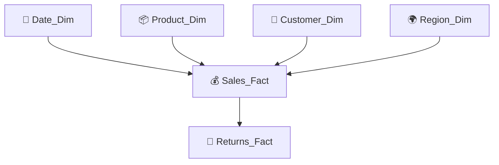
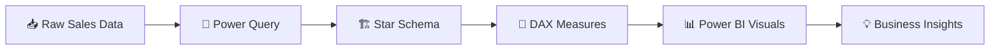

# 📊 Sales & Customer Intelligence Dashboard

<p align="center">
  <strong>End-to-End Power BI Business Intelligence Project</strong><br>
  Transforming raw sales data into interactive, decision-ready insights.
</p>

<p align="center">
  


</p>

---

## 🧭 Quick Navigation

<details open>
<summary><strong>Click to explore the project</strong></summary>

- [📌 Overview](#-overview)
- [✨ Features](#-features)
- [📂 Dataset](#-dataset)
- [🏗️ Data Model](#️-data-model)
- [📊 Dashboard Pages](#-dashboard-pages)
- [📈 KPI Framework](#-key-kpis)
- [🧮 DAX Measures](#-dax-measures)
- [🛠️ Tools & Technologies](#️-tools--technologies)
- [🖼️ Dashboard Preview](#️-dashboard-preview)
- [📁 Project Structure](#-project-structure)
- [🚀 How to Run](#-how-to-run)
- [💡 Business Insights](#-business-insights)
- [🔮 Future Improvements](#-future-improvements)
- [👨‍💻 Author](#-author)

</details>

---

## 📌 Overview

The **Sales & Customer Intelligence Dashboard** is an end-to-end **Power BI Business Intelligence project** that transforms raw sales data into meaningful business insights.

The project combines:

- Professional **data modeling**
- **DAX** calculations
- **Power Query** data preparation
- Interactive **Power BI visualizations**
- Executive-level **KPIs**
- Customer and product analysis
- Regional performance analysis
- Return analysis
- Time-intelligence calculations

> 🎯 **Goal:** provide a single interactive environment for understanding sales performance, customer behavior, regional trends, product performance, and returns.

---

## ✨ Features

| Feature | Purpose |
|---|---|
| ⭐ Star Schema | Structured and scalable BI data model |
| 📊 Interactive Dashboard | Explore data using visuals and filters |
| 📈 Executive KPIs | Monitor important business metrics |
| 📅 Time Intelligence | Analyze YTD, MTD, YoY and trends |
| 🎯 Dynamic Slicers | Filter the dashboard interactively |
| 🔍 Cross Filtering | Explore relationships between visuals |
| 📦 Product Analysis | Identify top, bottom and profitable products |
| 👥 Customer Insights | Understand customer behavior and sales |
| 🌍 Regional Analysis | Compare regional performance |
| 🔄 Return Analysis | Monitor returned orders and return rate |
| ⚡ Optimized DAX | Reusable analytical measures |

---

# 📂 Dataset

The dashboard uses multiple related tables following a **Star Schema**.

<details>
<summary><strong>📋 View all tables</strong></summary>

| Table | Description |
|---|---|
| `Sales_Fact` | Sales transactions |
| `Customer_Dim` | Customer information |
| `Product_Dim` | Product details |
| `Region_Dim` | Regional information |
| `Date_Dim` | Calendar/date table |
| `Returns_Fact` | Return records |

</details>

---

# 🏗️ Data Model

The project follows a central fact-table architecture with supporting dimension tables.



<details>
<summary><strong>🔎 Why this model?</strong></summary>

The Star Schema separates:

- **Fact data** — transactional measurements such as sales and returns.
- **Dimension data** — descriptive information such as customer, product, region and date.

This structure supports interactive filtering and analytical DAX calculations.

</details>

---

# 📊 Dashboard Pages

## 🏠 Executive Dashboard

<details>
<summary><strong>View included analysis</strong></summary>

- 💰 Total Sales
- 🧾 Total Orders
- 👥 Total Customers
- 🔄 Total Returns
- 📊 Return Rate
- 📈 Monthly Sales Trend
- 🌍 Sales by Region
- 📦 Sales by Category
- 🏆 Top Products

</details>

---

## 👥 Customer Analysis

<details>
<summary><strong>View included analysis</strong></summary>

- Customer Distribution
- Customer Segments
- Top Customers
- Customer Sales
- Customer purchasing behavior

</details>

---

## 📦 Product Analysis

<details>
<summary><strong>View included analysis</strong></summary>

- Top Products
- Bottom Products
- Product Categories
- Product Profitability

</details>

---

## 🌍 Regional Analysis

<details>
<summary><strong>View included analysis</strong></summary>

- Region-wise Sales
- Region-wise Returns
- Regional Profit
- Regional Performance

</details>

---

## 📅 Time Analysis

<details>
<summary><strong>View included analysis</strong></summary>

- Monthly Sales
- Quarterly Sales
- Yearly Sales
- YTD Sales
- MTD Sales
- YoY Growth

</details>

---

# 📈 Key KPIs

| KPI | Business Meaning |
|---|---|
| 💰 **Total Sales** | Overall revenue |
| 🧾 **Total Orders** | Number of orders |
| 👥 **Total Customers** | Customer count |
| 📦 **Units Sold** | Quantity sold |
| 🔄 **Total Returns** | Returned orders |
| 📊 **Return Rate** | Percentage of returned orders |
| 💵 **Average Order Value** | Revenue generated per order |
| 📈 **Sales Growth** | Sales growth over time |

<details>
<summary><strong>📌 KPI categories</strong></summary>

### Revenue
Total Sales · Average Order Value · Sales Growth

### Customers
Total Customers · Customer Sales · Customer Segments

### Products
Units Sold · Top Products · Product Profitability

### Returns
Total Returns · Return Rate · Regional Returns

### Time
YTD · MTD · YoY Growth · Monthly Trends

</details>

---

# 🧮 DAX Measures

The dashboard includes analytical measures for sales, customers, orders, returns and time intelligence.

<details>
<summary><strong>📊 Core Measures</strong></summary>

- Total Sales
- Total Orders
- Total Customers
- Total Units Sold
- Total Returns
- Return Rate
- Average Order Value

</details>

<details>
<summary><strong>📅 Time Intelligence Measures</strong></summary>

- Sales YTD
- Sales MTD
- Previous Year Sales
- YoY Growth %

</details>

<details>
<summary><strong>🧠 DAX workflow</strong></summary>

```text
Raw Data
   ↓
Power Query
   ↓
Star Schema
   ↓
Relationships
   ↓
DAX Measures
   ↓
Visualizations
   ↓
Interactive Dashboard
```

</details>

---

# 🛠️ Tools & Technologies

| Technology | Usage |
|---|---|
| **Microsoft Power BI** | Dashboard and visualization |
| **DAX** | Measures and calculations |
| **Power Query** | Data transformation |
| **Microsoft Excel** | Source/data preparation |
| **Data Modeling** | Relationships and analytical structure |
| **Star Schema** | BI model architecture |

---

# 🖼️ Dashboard Preview

> Place your screenshots inside the `images/` folder using the filenames below.

<details open>
<summary><strong>🏠 Executive Dashboard</strong></summary>


</details>

<details>
<summary><strong>👥 Customer Analysis</strong></summary>


</details>

<details>
<summary><strong>📦 Product Analysis</strong></summary>


</details>

<details>
<summary><strong>🌍 Regional Analysis</strong></summary>


</details>

<details>
<summary><strong>📅 Time Analysis</strong></summary>


</details>

---

# 📁 Project Structure

```text
Sales-Customer-Intelligence-Dashboard/
│
├── 📊 Dashboard.pbix
├── 📗 Dataset.xlsx
├── 📄 README.md
│
├── 🖼️ images/
│   ├── executive-dashboard.png
│   ├── customer-analysis.png
│   ├── product-analysis.png
│   ├── regional-analysis.png
│   └── time-analysis.png
│
└── 📦 assets/
```

---

# 🚀 How to Run

<details open>
<summary><strong>Step 1 — Download the project</strong></summary>

Download or clone the project repository.

```bash
git clone <repository-url>
```

</details>

<details>
<summary><strong>Step 2 — Open Power BI</strong></summary>

Open:

```text
Dashboard.pbix
```

using **Microsoft Power BI Desktop**.

</details>

<details>
<summary><strong>Step 3 — Refresh the data</strong></summary>

If required:

```text
Home → Refresh
```

Refresh the source dataset and verify that all relationships and measures load correctly.

</details>

<details>
<summary><strong>Step 4 — Explore the dashboard</strong></summary>

Use:

- Slicers
- Filters
- Cross-highlighting
- Interactive visuals
- Time filters
- Category filters
- Regional filters

to explore the dashboard.

</details>

---

# 💡 Business Insights

The dashboard is designed to answer questions such as:

<details>
<summary><strong>💰 Sales Performance</strong></summary>

- How are sales performing over time?
- Which periods generate the most sales?
- How is current performance compared with previous periods?

</details>

<details>
<summary><strong>📦 Product Performance</strong></summary>

- Which products perform best?
- Which products perform poorly?
- Which categories contribute most to sales?
- Which products are most profitable?

</details>

<details>
<summary><strong>👥 Customer Intelligence</strong></summary>

- Who are the top customers?
- How is customer sales distributed?
- Which customer segments contribute most?

</details>

<details>
<summary><strong>🌍 Regional Intelligence</strong></summary>

- Which regions generate the highest sales?
- Which regions have higher returns?
- How does regional profitability compare?

</details>

<details>
<summary><strong>🔄 Return Analysis</strong></summary>

- How many orders are returned?
- What is the overall return rate?
- Which regions or products contribute to returns?

</details>

---

# 🔮 Future Improvements

The project can be extended with:

| Improvement | Potential Benefit |
|---|---|
| 🤖 AI Insights | Automated insight generation |
| 🔮 Forecasting | Future sales prediction |
| 🔍 Drill Through Pages | Detailed record-level analysis |
| 🔖 Bookmarks | Guided dashboard navigation |
| 📱 Mobile Layout | Better mobile experience |
| 🔐 Row-Level Security | Controlled user access |
| ☁️ Power BI Service | Online deployment and sharing |

---

# 📌 Project Flow



---

# 🎯 What This Project Demonstrates

<details open>
<summary><strong>Click to expand</strong></summary>

### Data Engineering
- Data preparation
- Power Query transformation
- Fact/dimension organization
- Relationship design

### Data Modeling
- Star Schema
- Dimension tables
- Fact tables
- Calendar table

### Analytics
- KPI development
- DAX measures
- Time intelligence
- Return analysis
- Customer analysis

### Business Intelligence
- Interactive dashboards
- Cross filtering
- Slicers
- Executive reporting
- Business insight generation

</details>

---

# 👨‍💻 Author

**Prince**

AI & Data Science Student

`Power BI` · `SQL` · `Excel` · `Python`

---

# ⭐ Support

If you found this project useful, consider giving the repository a ⭐ on GitHub.

It helps support future data analytics and Power BI projects.

---

<p align="center">

**📊 Sales & Customer Intelligence Dashboard**

*Turning data into decisions.*

</p>
